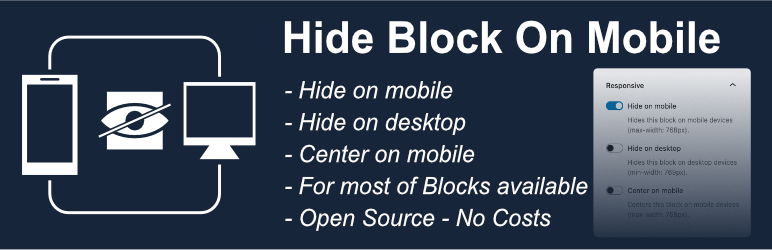
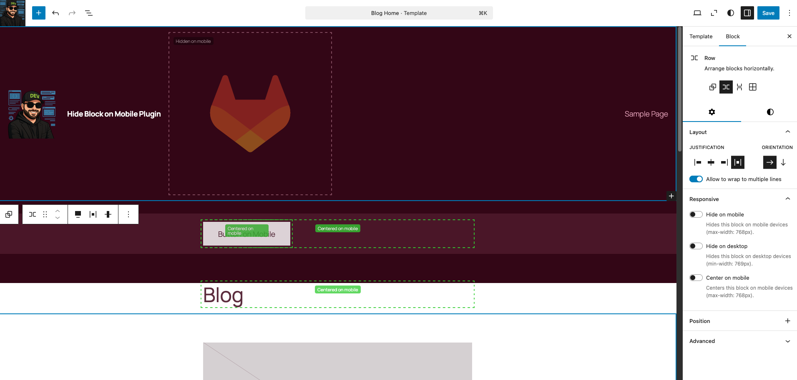

<p align="center">
  
</p>

# Hide Block On Mobile

A WordPress plugin that adds responsive visibility controls to the block inspector, allowing you to hide any Gutenberg block on mobile or desktop devices.

## Description

This plugin extends the WordPress block editor (Gutenberg) by adding a "Responsive" panel to every block's settings sidebar. Control the visibility of your blocks across different devices:

- **Hide on mobile**: Adds the `hide-mobile` CSS class - hides blocks on screens smaller than 768px
- **Hide on desktop**: Adds the `hide-desktop` CSS class - hides blocks on screens larger than 768px
- **Center on mobile**: Adds the `center-mobile` CSS class - centers block content on screens smaller than 768px

**Features:**
- Works with all Gutenberg blocks (core and third-party)
- Two independent toggle controls in the block inspector
- Adds CSS classes automatically
- Visual indicators in the editor when blocks are hidden
- Both options can be used simultaneously if needed
- No configuration needed - activate and use

## Installation

### For End Users (Recommended)

**No build process required!** Download the ready-to-use plugin:

1. Go to the [Releases](../../releases) page
2. Download the latest `triopsi-block-visibility.zip` file
3. In WordPress admin, go to Plugins → Add New → Upload Plugin
4. Choose the downloaded ZIP file and click "Install Now"
5. Activate the plugin
6. Done! The "Responsive" panel will now appear in every block's settings

### For Developers (Manual Build)

If you want to modify the plugin or build from source:

1. Clone this repository or download the source code
2. Navigate to the plugin directory
3. Run `npm install` to install dependencies
4. Run `npm run build` to compile the assets
5. Upload the `triopsi-block-visibility` folder to `/wp-content/plugins/`
6. Activate the plugin through the 'Plugins' menu in WordPress

## Usage

1. Open the WordPress block editor (Gutenberg)
2. Select any block you want to control
3. In the right sidebar, find the "Responsive" panel
4. Toggle "Hide on mobile" to hide the block on mobile devices (max-width: 768px)
5. Toggle "Center on mobile" to center the block's content on mobile devices (max-width: 768px)
6. Toggle "Hide on desktop" to hide the block on desktop devices (min-width: 769px)
7. You can enable both hide options if you want to hide the block everywhere (useful for draft content)

**Editor Visual Indicators:**
- Blocks with "Hide on mobile" show a black dashed outline with a label
- Blocks with "Hide on desktop" show a blue dashed outline with a label
- Blocks with both options show a purple dashed outline with a combined label
- Blocks with "Center on mobile" show a green dashed outline with a label and appear centered in the editor mobile preview

## Development

Build the plugin:
```bash
npm install
npm run build
```

Watch mode for development:
```bash
npm run start
```

## License

This plugin is licensed under the GPL v2 or later.

```
Hide Block On Mobile
Copyright (C) 2026

This program is free software; you can redistribute it and/or modify
it under the terms of the GNU General Public License as published by
the Free Software Foundation; either version 2 of the License, or
(at your option) any later version.

This program is distributed in the hope that it will be useful,
but WITHOUT ANY WARRANTY; without even the implied warranty of
MERCHANTABILITY or FITNESS FOR A PARTICULAR PURPOSE.  See the
GNU General Public License for more details.

You should have received a copy of the GNU General Public License along
with this program; if not, write to the Free Software Foundation, Inc.,
51 Franklin Street, Fifth Floor, Boston, MA 02110-1301 USA.
```

## Requirements

- WordPress 6.8 or higher
- PHP 7.4 or higher
- Node.js and npm (for development)

## Screenshots


